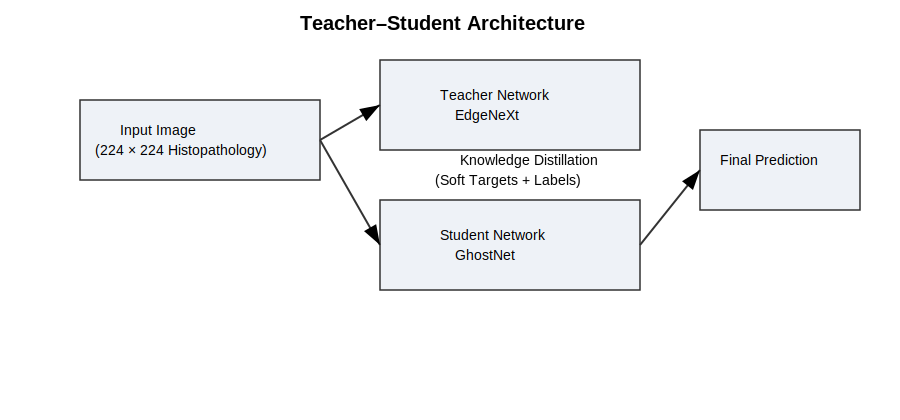
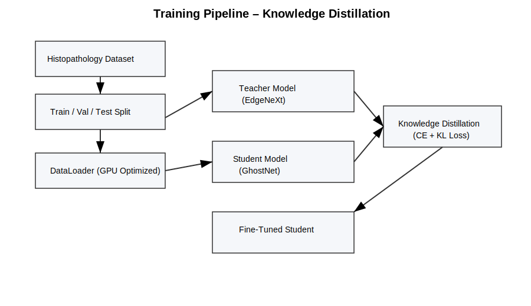
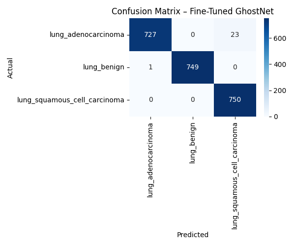

# 🫁 Lung Cancer Classification using Knowledge Distillation

A **fast, lightweight, and highly accurate deep learning system** for lung cancer histopathological image classification using **Knowledge Distillation**.

The project transfers knowledge from a powerful **EdgeNeXt (Teacher)** model to a lightweight **GhostNet (Student)**, achieving **99% test accuracy** while maintaining **low inference latency**, making it suitable for **real-time and low-resource clinical environments**.

---

## 🔬 Problem Statement

Accurate classification of lung cancer subtypes from histopathology images is crucial for early diagnosis and treatment planning. However, most deep learning models are computationally heavy and unsuitable for deployment in low-resource clinical systems.

**This project addresses that challenge by:**
- Retaining high diagnostic accuracy
- Reducing model size and inference time
- Enabling efficient deployment using a lightweight student network

---

## 🚀 Key Features

- ✅ Knowledge Distillation (Teacher–Student learning)
- ✅ Lightweight GhostNet model
- ✅ Fine-tuned after distillation
- ✅ High accuracy (99%)
- ✅ Fast inference (CPU & GPU benchmarked)
- ✅ Clinically interpretable evaluation

---

## 🧠 Model Architecture

The system follows a teacher–student learning paradigm where a high-capacity
EdgeNeXt model guides a lightweight GhostNet student using knowledge distillation.



### Teacher Model
- **EdgeNeXt-Small**
- High-capacity CNN
- Used only during training

### Student Model
- **GhostNet**
- Lightweight and fast
- Used for inference and deployment

📌 The student learns from both **ground-truth labels** and **soft targets** generated by the teacher.

---

## 📊 Dataset

**Dataset:** LC25000 – Lung and Colon Histopathological Images  
**Classes Used (Lung only):**
- Lung Adenocarcinoma
- Lung Benign Tissue
- Lung Squamous Cell Carcinoma

**Images:** 15,000 lung histopathology images  
**Split:**
- Train: 70%
- Validation: 15%
- Test: 15%

📎 Dataset link:  
https://www.kaggle.com/datasets/andrewmvd/lung-and-colon-cancer-histopathological-images

> ⚠️ Dataset is not included in this repository due to size constraints.

---

## 🏗️ Project Pipeline

The complete training and evaluation pipeline is illustrated below.



1. Dataset preprocessing and splitting  
2. GPU-optimized data loading  
3. Teacher model training (EdgeNeXt)  
4. Knowledge distillation to student (GhostNet)  
5. Fine-tuning the student model  
6. Test-set evaluation  
7. Inference speed benchmarking  

---

## 📈 Results
The fine-tuned GhostNet student achieved 99% accuracy on the test set.

### 🔹 Classification Performance (Test Set)

| Class | Precision | Recall | F1-score |
|------|----------:|-------:|---------:|
| Lung Adenocarcinoma | 1.00 | 0.97 | 0.98 |
| Lung Benign | 1.00 | 1.00 | 1.00 |
| Lung Squamous Cell | 0.97 | 1.00 | 0.98 |

**Overall Accuracy:** **99%**

---

### 🔹 Confusion Matrix



**Observation:**  
Minor confusion occurs between adenocarcinoma and squamous carcinoma, which is clinically plausible due to overlapping histopathological features.

---

## ⚡ Inference Speed Benchmark

| Device | Avg Inference Time |
|------|-------------------:|
| GPU (RTX 3060) | ~X ms |
| CPU | ~Y ms |

📌 The distilled GhostNet model achieves **real-time inference**.

---

## 🛠️ Installation & Setup

```bash
# Create environment
conda create -n lung_kd python=3.9
conda activate lung_kd

# Install dependencies
pip install -r requirements.txt
